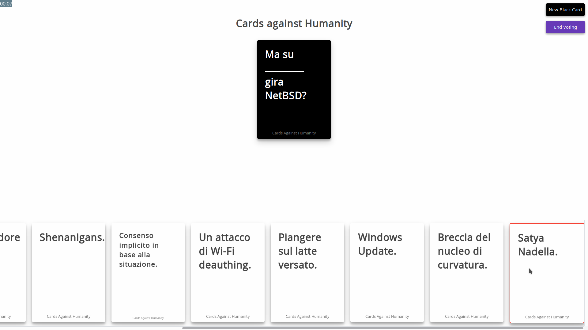

# Go Against Humanity

A Cards Against Humanity web game written in [Go](http://www.golang.org/).
The game is intended to be played with multiple players, divided into 
"players" and "jurors". The card that gets most votes wins.

Written in 3 days during the [End Summer Camp](https://www.endsummercamp.org). Meant to be played for a good laugh together.

### Start the web server:

   revel run

### Tell the players / jurors to go to http://<your-ip>:9000/ and enjoy the game!

## Based on Revel
### Code Layout

The directory structure of a generated Revel application:

    conf/             Configuration directory
        app.conf      Main app configuration file
        routes        Routes definition file

    app/              App sources
        init.go       Interceptor registration
        controllers/  App controllers go here
        views/        Templates directory

    messages/         Message files

    public/           Public static assets
        css/          CSS files
        js/           Javascript files
        images/       Image files

    tests/            Test suites

### Help

* The [Getting Started with Revel](http://revel.github.io/tutorial/gettingstarted.html).
* The [Revel guides](http://revel.github.io/manual/index.html).
* The [Revel sample apps](http://revel.github.io/examples/index.html).
* The [API documentation](https://godoc.org/github.com/revel/revel).

